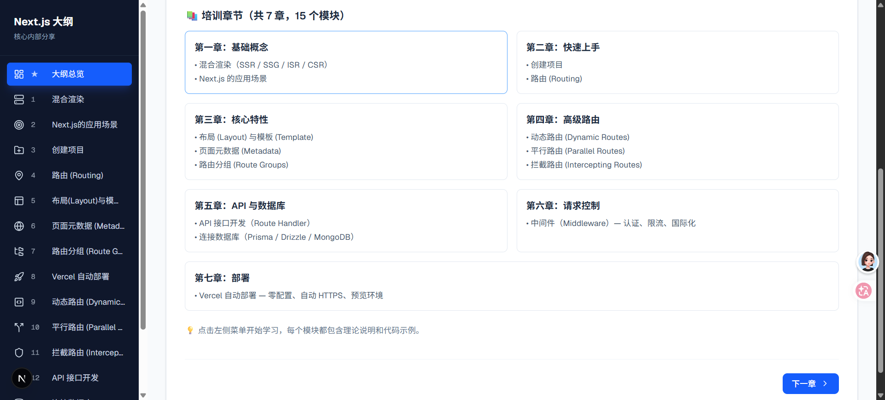

# Next.js Compass 🧭

Next.js 核心知识导航与培训系统，涵盖从基础概念到高级特性的完整学习路径。


## 技术栈

| 技术 | 版本 |
|------|------|
| Next.js | 16.x |
| React | 19.x |
| TypeScript | 5.x |
| Tailwind CSS | 4.x |
| Lucide React | 1.x |

## 培训大纲

共 **7 章**、**15 个模块**，系统覆盖 Next.js 核心能力：

| 章节 | 模块 |
|------|------|
| 第一章：基础概念 | 混合渲染（SSR / SSG / ISR / CSR）、应用场景 |
| 第二章：快速上手 | 创建项目、路由 (Routing) |
| 第三章：核心特性 | 布局与模板、页面元数据、路由分组 |
| 第四章：高级路由 | 动态路由、平行路由、拦截路由 |
| 第五章：API 与数据库 | API 接口开发、连接数据库（Prisma / Drizzle / MongoDB） |
| 第六章：请求控制 | 中间件（认证、限流、国际化、A/B 测试） |
| 第七章：部署 | Vercel 自动部署 |

## 快速开始

```bash
# 安装依赖
npm install

# 启动开发服务器（端口 3001）
npm run dev

# 构建生产版本
npm run build

# 启动生产服务
npm start
```

打开 [http://localhost:3001](http://localhost:3001) 访问培训系统。

## 项目结构

```
next-compass/
├── src/
│   ├── app/              # Next.js App Router 页面
│   │   ├── layout.tsx    # 根布局
│   │   └── page.tsx      # 首页
│   ├── components/       # 公共组件
│   │   └── Sidebar.tsx   # 侧边栏导航
│   └── data/
│       └── topics.ts     # 全部培训内容数据
├── public/               # 静态资源
├── package.json
├── tsconfig.json
├── next.config.ts
└── tailwind.config.ts
```

## 待办

- [ ] 暗色模式
- [ ] 全文搜索
- [ ] 学习进度追踪
